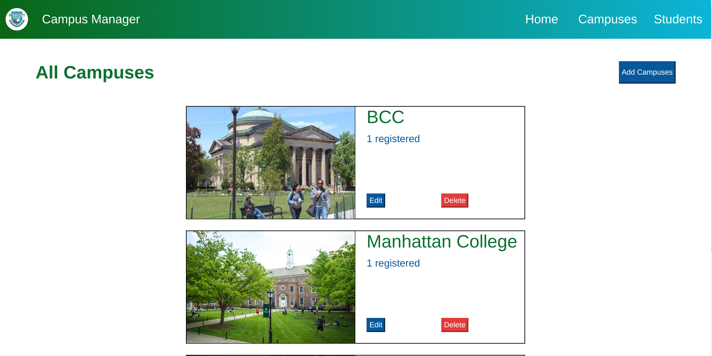
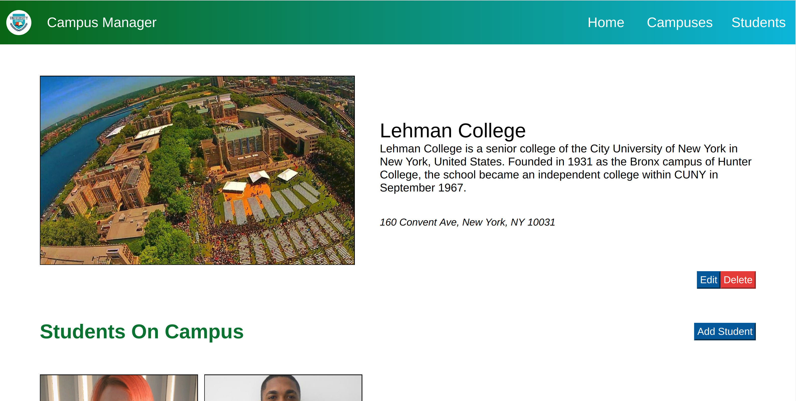
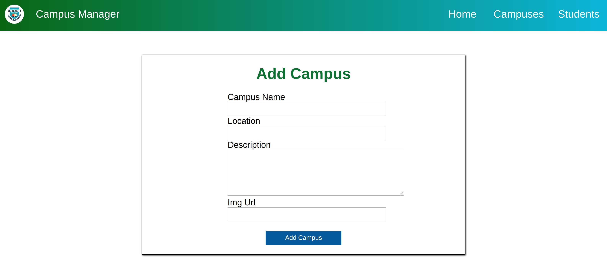
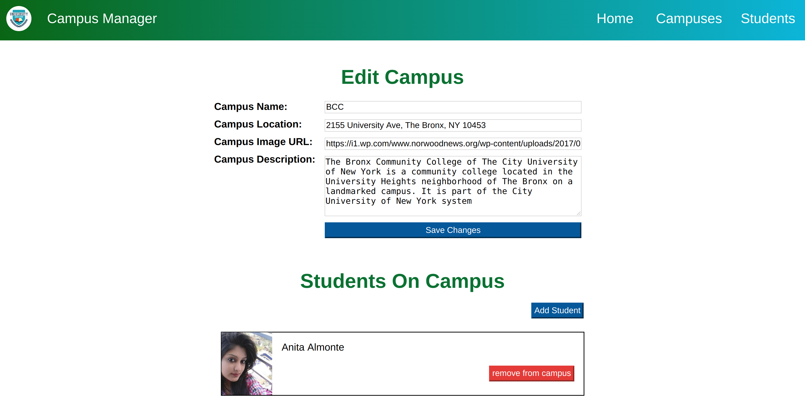
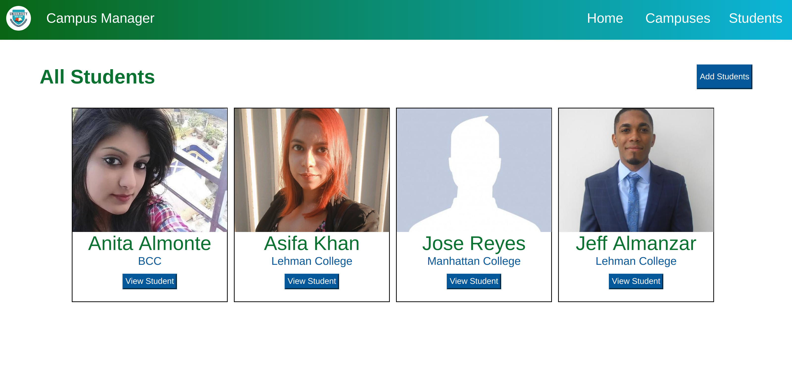
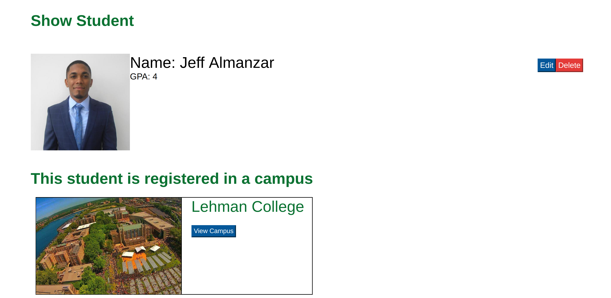
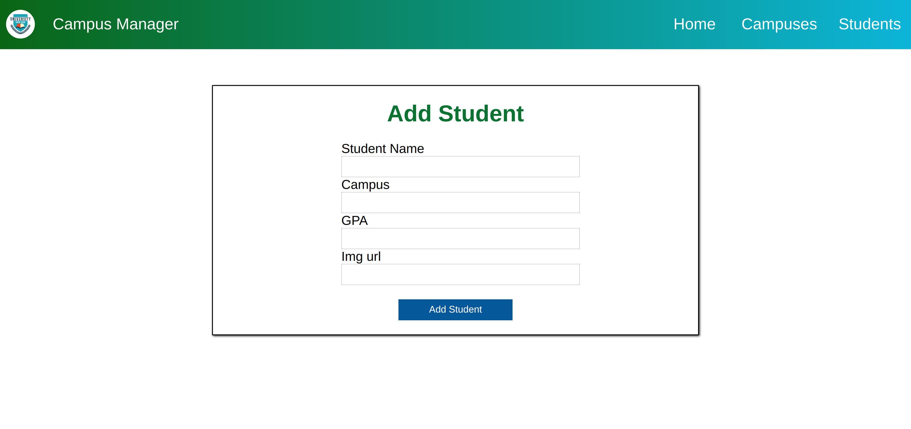
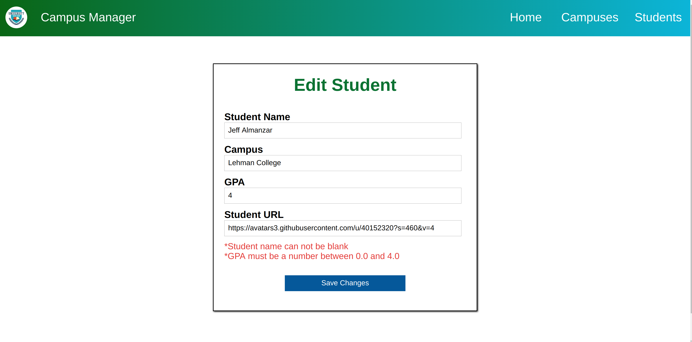

## Description  
• Full stack web application that manages students and campuses, allowing the user to add, edit, and remove campuses and students information.   
• Built with React JS, React-Router, React-Redux, Axios, Node JS/Express, Sequelize, and PostgreSQL.  
• Live demo: https://campusmanagerttp.netlify.com/

## Server side code  
https://github.com/Jeffrey-A/campusManagerServer 
  
## Home  

## Campuses 

## View Campus

## Add Campus 

## Edit Campus 

## Students 

## View Students

## Add Student 

## Edit Student
  
  

